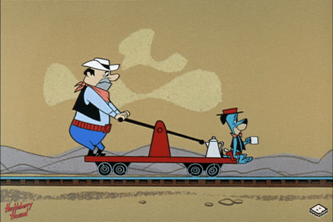

# It's time to make GIS railroads great again.

This repository provides scripts and tables that will hopefully help my fellow classmates add distance calculations from parcels to railroads in PostGres.

# Requirements
- [PostGres SQL](https://www.postgresql.org/) (version 13.1 used)
- [pgAdmin](https://www.pgadmin.org/) (version 4.29 used) 
- python 3 highly recommend to use [Anaconda Navigator](https://docs.anaconda.com/anaconda/install) on an isolated environment
- [QGIS](https://qgis.org/en/site/) Highly recommend for visualization of spatial queries
- Volusia county [shape files](http://maps.vcgov.org/gis/download/shapes.htm) (parcel ownership is most important) 

# Process for development of column (skip if you don't care)
1. Make sure required software and shapefiles are installed.
2. Download the [railroad geometries](https://www2.census.gov/geo/tiger/TIGER2020/RAILS/)  and import shape files into QGIS as a layer.
3. Convert geometries to SQL database using shp2psql
    - "c:\Program Files\PostgreSQL\13\bin\shp2pgsql.exe" -d -I -s 2236 -W "latin1" -g geom volusia_rr.shp volusia.railroads > create_railroads.sql
    - "c:\Program Files\PostgreSQL\13\bin\psql.exe" -U postgres -d spatial -f create_railroads.sql
    * NOTE: If an error related to DROP tables occurs when running the create_railroads.sql script, comment out that line. Cannot drop a table that doesn't exist.
    * RECOMMENDED: It may be a good idea to reproject the railroad shape file to volusia county only: ogr2ogr -f "ESRI Shapefile" -s_srs EPSG:4269 -t_srs EPSG:2236 volusia_test_rails.shp tl_2020_us_rails.shp -clipdst 316848 1548127 864189 1858999
    - The python script will work either way for calculations just a suggestion.
4. Once imported try to query some data from volusia.railroads
5. If successful try out some of the queries in the included SQL script. Try to understand what is going on.
6. Once the process is understood run the update_railroad_distances.py script. Notice how the loop just recurses SQL statements to insert into parcel table over and over again.
7. Run the last SQL statement in property_close_to_railroads.sql file to confirm it is added.

## Sanity Check

It is a VERY good idea to sanity check your SQL queries with QGIS. The nearest track example image shows the use of QGIS to confirm that a parcel is actually close to a railroad track. Sanity check a shows how print statements can be used to ensure that data is being queried as expected. Sanity check b shows the number of rows that have a geometry. This is useful for making sure that each distance is calculated. Sanity check c shows that the number of rows are equal.

# Data sample and full
Finalized data added to parcel table is included along with a small 100 row sample. You can simply import the data_full.csv if you don't want to develop the column on your own. Data from the volusia.sales_analysis table was uploaded to AWS. The full data set is also included in the data directory.

# Brief Report on Notable Findings

## Linear Regression vs. KNN

Linear regression was compared to KNN for regression against railroad distance as well as 5 other attributes submited by other students (see the notebooks section for more details). Both models were trained and tested on parcels limited to 400ft of a railroad. KNN was trained on 5 nearest neighbors per the rubric. 

Overall it seems that KNN tends to have smaller differences when predicting house prices.

Examples with house 4

Linear Regression:

KNN:

Because Linear Regression also tends to have lower R Squared scores I believe the difference in prediction difference could be a result of overtraining.

## Railroad distance itself probably does not matter
Note this correlation matrix graph:

The railroad distance metric in the image above has almost 0 correlation with any of the other variables when compared to the entire county.

After some analysis was done it was discovered that a slight negative correlation is discovered with a filter for houses within **400ft** of a railroad track.

I believe that this correlation is indicative of the size of the house more so than the the distance to a railroad. Total area of a house has a similar negative correlation to rrdistance as rrdistance has to price. This could mean that houses near a railroad just tend to be smaller. Total area has a correlation to price regardless of its distance to a railroad track.

## Regression may only be accurate for 3 bedroom houses

This is more of a result of sample size than anything. Because most houses in volusia county are 3 bedrooms and most houses are not within 400ft of a railroad a pretty good chunk of the total population is cut out from analysis. It was decided (rightly or not) to focus regression efforts on 3 bedroom houses within 400ft of a railroad. Further analysis on other bedroom sizes would have to be done to confirm.

## Distance to a local crime matters

During regression for other class members attributes it was discovered that distance to a local crime seems to generate consistently high R-Squared metrics in linear regression and usually produces higher R-Squared metrics than other attributes in KNN.

These attributes were added in addition to total_area, rrdistance, and aprland.

# Overall Conclusion

Decent regression results on the basis of prediction differences. Because this was a database class and not a modeling class not much attention was paid towards parameter tuning. Definitely some room for improvement in that regard. More exploratory data analysis could be done to determine other attributes that could be indicative of a price.

# To Do
- Add a video (too lazy to do this right now)
- ~~Add images to README (I literally built a script called lazy-scan...)~~ -DONE!
- ~~Regression~~ - DONE!
- ~~AWS export and Folium viewing~~ - DONE!
- ~~Effing reporting (Not fun...)~~ - DONE!

# Contributing
I like pull requests. Let's make railroad GIS great again.

